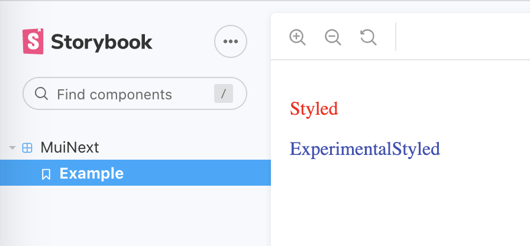

# muinext-storybook

This repo demonstrates a problem with Material UI (5.0.0-alpha.27) **experimentalStyled** and **ThemeProvider** when running inside of storybook (6.1.21).

Result of

`yarn start`

Result of

`yarn storybook`

